# ZCMC Payroll Server — Entity Relationship Diagram

Laravel-based payroll system. Schema reverse-engineered from `database/migrations` and `app/Models` on 2026-09-03.

Employee master data and time/attendance/leave data originate in a separate system, **UMIS** (`app/Models/UMIS/*`), reached over its own DB connection. `employees.employee_profile_id` is a soft reference (no real foreign key, since it points across databases) to UMIS's `employee_profiles.id`.

## Core payroll schema

```mermaid
erDiagram
    PAYROLL_PERIODS ||--o{ EMPLOYEE_SALARIES : "priced for"
    PAYROLL_PERIODS ||--o{ EMPLOYEE_TIME_RECORDS : covers
    PAYROLL_PERIODS ||--o{ EMPLOYEE_COMPUTED_SALARIES : covers
    PAYROLL_PERIODS ||--o{ EMPLOYEE_DEDUCTIONS : "billed in"
    PAYROLL_PERIODS ||--o{ EMPLOYEE_RECEIVABLES : "billed in"
    PAYROLL_PERIODS ||--o{ EXCLUDED_EMPLOYEES : "excludes for"
    PAYROLL_PERIODS ||--o{ EMPLOYEE_PAYROLLS : produces
    PAYROLL_PERIODS ||--o{ EMPLOYEE_NIGHT_DUTIES : covers
    PAYROLL_PERIODS ||--o{ EMPLOYEE_NIGHT_DIFF_COMPUTATIONS : covers
    PAYROLL_PERIODS ||--o{ EMPLOYEE_ADJUSTMENTS : "adjusted in"
    PAYROLL_PERIODS ||--o| PAYROLL_SUMMARIES : summarizes
    PAYROLL_PERIODS ||--o{ PAYROLL_PROCESSES : "run as"

    EMPLOYEES ||--o| EMPLOYEE_SALARIES : has
    EMPLOYEES ||--o| EMPLOYEE_TIME_RECORDS : has
    EMPLOYEES ||--o| EMPLOYEE_COMPUTED_SALARIES : has
    EMPLOYEES ||--o{ EMPLOYEE_DEDUCTIONS : has
    EMPLOYEES ||--o{ EMPLOYEE_RECEIVABLES : has
    EMPLOYEES ||--o{ EXCLUDED_EMPLOYEES : "excluded via"
    EMPLOYEES ||--o{ EMPLOYEE_PAYROLLS : has
    EMPLOYEES ||--o{ EMPLOYEE_NIGHT_DUTIES : logs
    EMPLOYEES ||--o{ EMPLOYEE_NIGHT_DIFF_COMPUTATIONS : has

    EMPLOYEE_TIME_RECORDS ||--o| EMPLOYEE_COMPUTED_SALARIES : "feeds"
    EMPLOYEE_TIME_RECORDS ||--o{ EMPLOYEE_PAYROLLS : "feeds"

    DEDUCTION_GROUPS ||--o{ DEDUCTIONS : groups
    DEDUCTIONS ||--o{ DEDUCTION_RULES : "priced by"
    DEDUCTIONS ||--o{ EMPLOYEE_DEDUCTIONS : "assigned as"
    DEDUCTIONS ||--o{ IMPORT_FILES : "imported via"
    DEDUCTIONS ||--o{ IMPORT_FILE_LOGS : "imported via"

    RECEIVABLES ||--o{ RECEIVABLE_RULES : "priced by"
    RECEIVABLES ||--o{ EMPLOYEE_RECEIVABLES : "assigned as"
    RECEIVABLES ||--o{ IMPORT_FILES : "imported via"
    RECEIVABLES ||--o{ IMPORT_FILE_LOGS : "imported via"

    EMPLOYEE_DEDUCTIONS ||--o{ EMPLOYEE_DEDUCTION_LOGS : logs
    EMPLOYEE_DEDUCTIONS ||--o{ EMPLOYEE_DEDUCTION_TRAILS : "payment history"
    EMPLOYEE_DEDUCTIONS ||--o{ STOPPAGE_LOGS : "stop/resume history"
    EMPLOYEE_DEDUCTIONS ||--o{ EMPLOYEE_ADJUSTMENTS : "adjusted by"

    EMPLOYEE_RECEIVABLES ||--o{ EMPLOYEE_RECEIVABLE_LOGS : logs
    EMPLOYEE_RECEIVABLES ||--o{ EMPLOYEE_RECEIVABLE_TRAILS : "receipt history"
    EMPLOYEE_RECEIVABLES ||--o{ STOPPAGE_LOGS : "stop/resume history"
    EMPLOYEE_RECEIVABLES ||--o{ EMPLOYEE_ADJUSTMENTS : "adjusted by"

    PAYROLL_PERIODS {
        bigint id PK
        string month
        string year
        string employment_type
        int payroll_type "REGULAR/etc, enum PayrollType"
        string period_type "1st-half/2nd-half/monthly"
        int period_start
        int period_end
        int days_of_duty "default 22"
        string status
        bool is_active
        datetime posted_at
        datetime locked_at
        datetime last_generated_at
    }

    EMPLOYEES {
        bigint id PK
        int employee_profile_id UK "ref UMIS.employee_profiles.id"
        string employee_number
        string first_name
        string last_name
        string middle_name
        string extension_name
        string designation
        json assigned_area
        string status
        bool is_newly_hired
        bool is_excluded
        bool is_resigned
    }

    EMPLOYEE_SALARIES {
        bigint id PK
        bigint employee_id FK
        bigint payroll_period_id FK
        string employment_type
        decimal base_salary
        int salary_grade
        int salary_step
        bool is_active
    }

    EMPLOYEE_TIME_RECORDS {
        bigint id PK
        bigint employee_id FK
        bigint payroll_period_id FK
        decimal total_working_minutes
        decimal total_working_hours
        decimal total_overtime_minutes
        decimal total_undertime_minutes
        decimal total_official_business_minutes
        decimal total_official_time_minutes
        decimal total_leave_minutes
        decimal total_night_duty_hours
        decimal no_of_present_days
        decimal no_of_absences
        decimal no_of_leave_wo_pay
        decimal no_of_leave_w_pay
        decimal no_of_invalid_entry
        decimal no_of_day_off
        decimal no_of_schedule
        string month
        string year
        string from
        string to
        string status
        bool is_active
        datetime locked_at
    }

    EMPLOYEE_COMPUTED_SALARIES {
        bigint id PK
        bigint employee_id FK
        bigint payroll_period_id FK
        bigint employee_time_record_id FK
        decimal basic_pay "excl. night diff & deductions"
        decimal minutes_rate
        decimal daily_rate
        decimal hourly_rate
        decimal absent_rate
        decimal undertime_rate
    }

    DEDUCTION_GROUPS {
        bigint id PK
        uuid deduction_group_uuid UK
        string name
        string code
    }

    DEDUCTIONS {
        bigint id PK
        uuid deduction_uuid UK
        bigint deduction_group_id FK
        string name
        string code
        string type "fixed/percentage/conditional"
        string billing_cycle
        decimal percent_value
        decimal fixed_amount
        date date_start
        date date_end
        string status
    }

    DEDUCTION_RULES {
        bigint id PK
        bigint deduction_id FK
        decimal min_salary
        decimal max_salary
        string apply_type "fixed/percentage"
        string value
        date date_start
        date date_end
        string status
    }

    RECEIVABLES {
        bigint id PK
        uuid receivable_uuid UK
        string name
        string code
        string type "fixed/percentage/conditional"
        string billing_cycle
        decimal percent_value
        decimal fixed_amount
        date date_start
        date date_end
        string status
    }

    RECEIVABLE_RULES {
        bigint id PK
        bigint receivable_id FK
        decimal min_salary
        decimal max_salary
        string apply_type
        string value
        date date_start
        date date_end
        string status
    }

    IMPORT_FILES {
        bigint id PK
        bigint deduction_id FK "nullable"
        bigint receivable_id FK "nullable"
        string file_name
        string path
    }

    IMPORT_FILE_LOGS {
        bigint id PK
        bigint deduction_id FK "nullable"
        bigint receivable_id FK "nullable"
        string file_name
        string employment_type
        date payroll_date
    }

    EMPLOYEE_DEDUCTIONS {
        bigint id PK
        bigint payroll_period_id FK "nullable"
        bigint employee_id FK
        bigint deduction_id FK
        string billing_cycle
        decimal amount
        decimal percentage
        string date_from
        string date_to
        bool with_terms
        int total_term
        int total_paid
        string reason
        string status
        text isDifferential
        bool is_default
        date effective_date
        date deduct_at
        datetime stopped_at
        datetime completed_at
    }

    EMPLOYEE_DEDUCTION_LOGS {
        bigint id PK
        bigint employee_deduction_id FK
        bigint action_by
        string action
        string remarks
        text details
    }

    EMPLOYEE_DEDUCTION_TRAILS {
        bigint id PK
        bigint employee_deduction_id FK
        int total_term
        int total_term_paid
        decimal amount_paid
        decimal balance
        datetime date_paid
        string status
        bool is_last_payment
        bool is_adjustment
    }

    EMPLOYEE_RECEIVABLES {
        bigint id PK
        bigint payroll_period_id FK "nullable"
        bigint employee_id FK
        bigint receivable_id FK
        string billing_cycle
        decimal amount
        decimal percentage
        string date_from
        string date_to
        int total_paid
        string reason
        string status
        bool is_default
        date effective_date
        date received_at
        datetime stopped_at
        datetime completed_at
    }

    EMPLOYEE_RECEIVABLE_LOGS {
        bigint id PK
        bigint employee_receivable_id FK
        bigint action_by
        string action
        string remarks
        text details
    }

    EMPLOYEE_RECEIVABLE_TRAILS {
        bigint id PK
        bigint employee_receivable_id FK
        int total_term
        int total_term_received
        decimal amount_received
        decimal balance
        date date_received
        string status
        bool is_last_received
        bool is_adjustment
    }

    EXCLUDED_EMPLOYEES {
        bigint id PK
        bigint employee_id FK
        bigint payroll_period_id FK "nullable"
        string reason
        bool is_removed
    }

    EMPLOYEE_PAYROLLS {
        bigint id PK
        bigint employee_id FK
        bigint employee_time_record_id FK
        bigint payroll_period_id FK "nullable"
        decimal basic_pay
        decimal total_receivables
        decimal gross_pay
        decimal total_deductions
        decimal net_pay
        decimal first_half
        decimal second_half
    }

    EMPLOYEE_ADJUSTMENTS {
        bigint id PK
        text action_by
        bigint payroll_period_id FK
        bigint employee_deduction_id FK "nullable"
        bigint employee_receivable_id FK "nullable"
        string amount
        string amount_to_pay
        string amount_balance
        string reason
    }

    STOPPAGE_LOGS {
        bigint id PK
        bigint action_by
        bigint employee_deduction_id FK "nullable"
        bigint employee_receivable_id FK "nullable"
        string date_from
        string date_to
        string status
        string reason
        string remarks
    }

    NIGHT_DIFFERENTIAL_RULES {
        bigint id PK
        string employment_type
        decimal rate_percent
        date effective_date
        bool is_active
    }

    EMPLOYEE_NIGHT_DUTIES {
        bigint id PK
        bigint employee_id FK
        bigint payroll_period_id FK
        date duty_date
        datetime time_in
        datetime time_out
        decimal night_minutes
        decimal night_hours
    }

    EMPLOYEE_NIGHT_DIFF_COMPUTATIONS {
        bigint id PK
        bigint employee_id FK
        bigint payroll_period_id FK
        decimal total_night_hours
        decimal total_night_amount
        decimal hourly_rate
        decimal rate_percent
        bool is_finalized
        datetime computed_at
    }

    PAYROLL_SUMMARIES {
        bigint id PK
        bigint payroll_period_id FK "nullable"
        int generated_by_id
        string generated_by_name
        int total_employees
        decimal total_deductions
        decimal total_receivables
        decimal total_gross
        decimal total_net
        decimal total_night_differential
    }

    PAYROLL_PROCESSES {
        bigint id PK
        bigint payroll_period_id FK "nullable"
        int payroll_type
        int current_step
        string status
        string started_by
        datetime started_at
    }
```



## Auth & audit schema (not tied into the payroll tables above)

```mermaid
erDiagram
    PERSONAL_ACCESS_TOKENS {
        bigint id PK
        string employee_id UK "UMIS employee id, string — no FK"
        string email
        string name
        string authorization_pin
        string token UK
        datetime expire_at
        text permissions
        timestamp last_used_at
    }

    USERS {
        bigint id PK
        note "Laravel scaffold table; app auth runs on personal_access_tokens/employee PIN instead"
    }

    LOGIN_TRAILS {
        bigint id PK
        bigint action_by
        string module_name
        string methods
        string description
        string status
    }

    TRANSACTION_LOGS {
        bigint id PK
        text module
        string action
        text status
        string ip_address
        string remarks
        string serverResponse
        text affected_entity "JSON"
        bigint employee_profile_id
        string employee_number
        string name
    }

    LOGS_AND_TRAILS {
        bigint id PK
        bigint action_by
        string module
        string action_type
        string reference_table
        bigint reference_id
        json changes
        string description
        string ip_address
        string status
    }

    ACTIVITY_LOG {
        bigint id PK
        string log_name
        text description
        string subject_type "polymorphic, e.g. Employee"
        bigint subject_id
        string causer_type "polymorphic"
        bigint causer_id
        json properties
        string event
        uuid batch_uuid
    }
```

## External system: UMIS

`app/Models/UMIS/*` are Eloquent models pointed at a **second database connection** (the hospital's Unified [HR/Payroll?] Information System). They are the source of truth for employee master data, org structure, schedules, time logs, and leave — none of them are foreign-keyed into this app's own database; the link is soft, via `employees.employee_profile_id = umis.employee_profiles.id`. `App\Services\EmployeeSyncService` and `FetchEmployeeMapperService` pull from UMIS (via Redis-cached fetch jobs, see `FetchEmployeeController`) and upsert into the local `employees` table.

Key UMIS entities referenced by the sync/time-record/adjustment logic:

- **Org structure**: `EmployeeProfile`, `PersonalInformation`, `Department`, `Division`, `Section`, `Unit`, `Designation`, `AssignArea`, `Plantilla`, `SalaryGrade`, `EmploymentType`
- **Schedule/attendance**: `Schedule`, `TimeShift`, `Holiday`, `DailyTimeRecords`, `OfficialTime`, `OfficialBusiness`, `CTOApplication`
- **Leave**: `LeaveType`, `LeaveApplication`, `LeaveApplicationLog`, `LeaveApplicationRequirement`, `EmployeeLeaveCredit`
- **Status**: `InActiveEmployee`

## Notes on the schema as written

- `employee_deductions`/`employee_receivables` carry a **nullable** `payroll_period_id`; the FK on `deductions.deduction_group_id` and most `unsignedBigInteger` FKs above are declared without explicit `->onDelete()`, so cascade behavior is DB-default (restrict).
- `employee_payrolls` is uniquely keyed per `(employee_id, employee_time_record_id, payroll_period_id)` (migration comment redacted the exact column list — confirm in `2025_05_06_160631_create_employee_payrolls_table.php` if you need the literal unique index).
- `Employee::excludedEmployees()` is `hasMany`, not `belongsTo` — a bug was fixed here per an in-code comment (a wrong `belongsTo` previously caused every employee to report the same fallback exclusion reason).
- `receivables` has no group table equivalent to `deduction_groups`.
